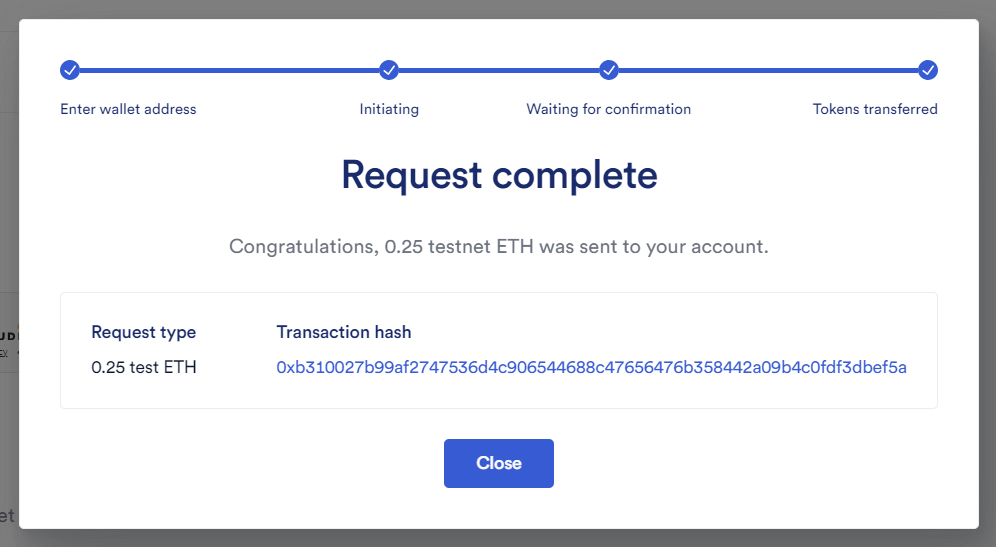
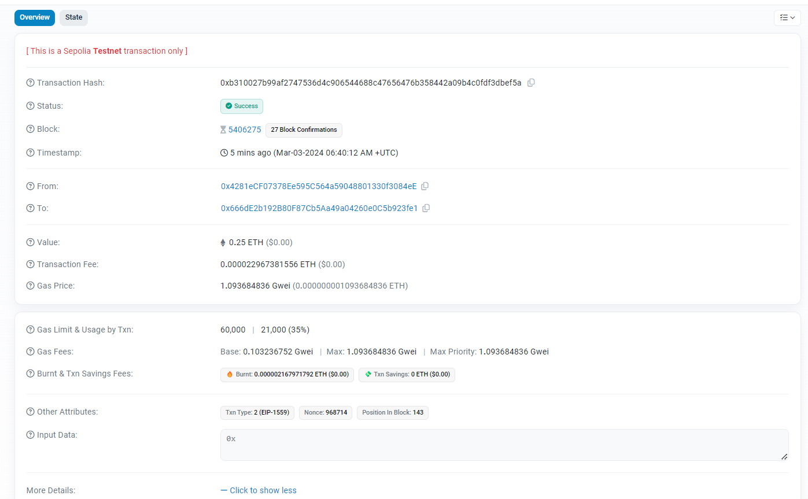
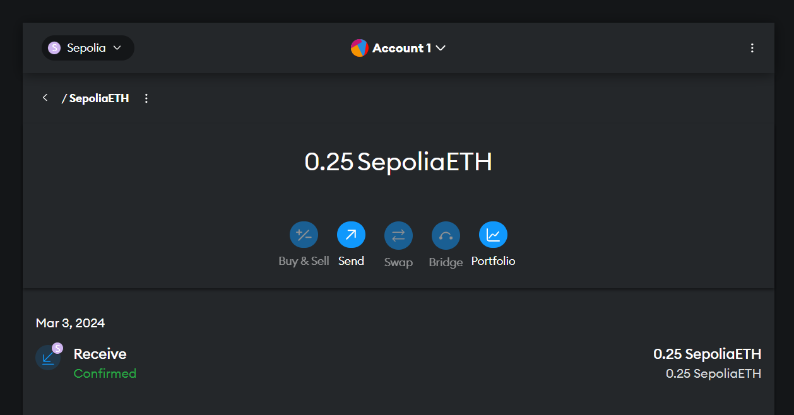
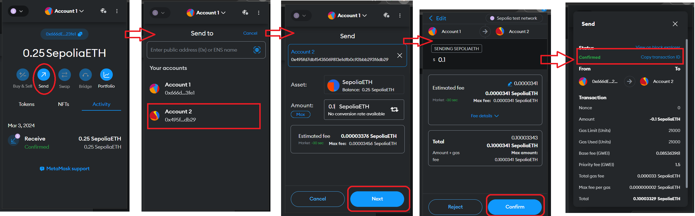

# Blockchain 

### Description
Blockchain is a decentralized, distributed ledger that records the provenance of a digital asset. It is a chain of blocks that contain data, with each block containing a hash of the previous block. The data in a block cannot be altered without altering all subsequent blocks, which requires the consensus of the network majority. This makes blockchain secure and tamper-proof.

### Bitcoin
- It was first introduced in 2008 by an unknown person or group of people using the name Satoshi Nakamoto.
- this network is a peer-to-peer network that allows users to send and receive bitcoins.
- this network is powered by cryptography and decentralized network of computers.
- allow people to engage cencership-resistant transactions.
- here is pdf of white paper of bitcoin: [click here](https://bitcoin.org/bitcoin.pdf).

## Ethereum

- It was proposed by Vitalik Buterin in late 2013 and development was crowdfunded in 2014.

- It is a decentralized platform that runs `smart contracts`(decentralize agreement) : applications that run exactly as programmed without any possibility of downtime, fraud or third party interference.

- It is a blockchain with a built-in Turing-complete programming language, meaning that it can run applications that are capable of performing any operation.

- **smart contracts**: is an Agreement, contract or set of instruction exceuted in decentralized way without the need of centralize of third party intermidiary.
    - Cann't be altered (immutable)
    - Automatically executed
    - Everyone can see the terms of the agreement

`Note`: Blockchain cann't read or write data from the outside world, it can only read and write data to its own blockchain. This is called oracle problem. 

Here comes `Chainlink` which is a decentralized oracle network that enables smart contracts to securely interact with real-world data, events and payments.

### Blockchain Oracles : 
- Any device that interraacts with the off-chain world and provides external data or coomputation to smart contracts on the blockchain.

`Note` we cann't work with single oracle, as we want to stay decentralized, we need multiple oracles to provide the same data. Here comes `Hybrid Smart Contracts`

* **Hybrid Smart Contracts :** Combining on-chain Decentralized logic with off-chain real-wrold data

### Gas

- Gas is a unit that measures the amount of computational effort required to execute operations on the Ethereum network.

- It is used to allocate resources of the Ethereum Virtual Machine (EVM) so that the network can remain decentralized.

- It goes high when the network is busy and goes low when the network is not busy.

### Transaction Fee

- Transaction fee is the amount of gas required to execute a transaction on the Ethereum network.

- we calculate the transaction fee by multiplying the gas price by the gas used.

### Hash

- A hash is a function that converts an input (or 'message') into a fixed-size string of bytes.

- **Ethereum** uses the Keccak-256 hash function, which is a variant of the SHA-3 (Secure Hash Algorithm 3) hash function.

- we need 4 zeros in the beginning of the hash to be considered as valid hash.

**Nounces** : A nonce is a number that is used only once. In Ethereum, the nonce is the number of transactions sent from a given address.

**Mining :** 
    - The process of finding the solution to the blockchain problem, ex: finding the hash with 4 zeros in the beginning.
    - Nodes get paid for mining by receiving a reward for each block mined.

**Block :** - A list of transactions mined together.

## MetaMask

- MetaMask is a software cryptocurrency wallet used to interact with the Ethereum blockchain.

- It allows users to access their Ethereum wallet through a browser extension or mobile app, which can then be used to interact with decentralized applications (dApps).

### Creating metaMask wallet

- Download the MetaMask extension from the Chrome Web Store.

- Click on the MetaMask icon in the top right corner of the browser and select 'Create a Wallet'.

- Create a password and click 'Create'.

- You will be given a secret backup phrase. Write this down and keep it in a safe place.

- Click 'Next' and confirm the secret backup phrase.

- Your wallet is now created and you can use it to interact with the Ethereum blockchain.

### Connecting to the Spolia Test Network

- Click on the network dropdown in the top left corner of the MetaMask extension and select 'Custom RPC'.

- Enter the following details:
    - Network Name: Spolinke Test Network
    - New RPC URL: https://faucets.chain.link/
    - Chain ID: 0x2a
    - Currency Symbol: ETH

### Getting Test Ether

- Go to the Spolinke Test Network faucet at https://faucets.chain.link/.

- Enter your MetaMask wallet address and click 'Send me test

### First transaction

#### Sending Ether to spolia test network

#### We got it

#### Frist Transection from Account 1 to Account 2

- In each transaction, some part of etherium is burn forever.

## High level blockchain fundamentals

### Concensus

- It is the Mechanism used to on the state of the blockchain.
- It can be broken down into to types:
    1. **Chain selection** : It is the ability of the network to agree on the longest chain.
    2. **Sybil Resistance:** It is the ability of a node to prevent the network from being taken over by a large number of Sybil nodes.
    (Sybil are just fake nodes that are created to take over the network.   )
    - Further, it can be broken down into two types:
        1. Proof of Work (`PoW`)
            - this is just a way to make sure that the network is secure and that the transactions are legitimate.
            - It takes lots of computational power to solve the problem because every node is trying to solve the problem as fast as possible.
        2. Proof of Stake (`PwS`)
            - this is a type of algorithm by which a cryptocurrency blockchain network aims to achieve distributed consensus.

- **Nakamoto Consensus** : It is a consensus mechanism that is used to confirm transactions and produce new blocks in the blockchain. combination of PoW and Sybil Resistance.

### Attack on Blockchain

1. **Sybil Attack** : It is an attack where a single entity controls multiple nodes on a network. This can be used to disrupt the network and prevent it from reaching consensus.

2. **51% Attack** : It is an attack where a single entity controls more than 50% of the network's mining power. This can be used to prevent new transactions from being confirmed and reverse transactions that were completed while the attacker was in control.

- **Note :** bigger the blockchain higher the security.

### ETH 2.0

- Ethereum 2.0 is an upgrade to the Ethereum network that aims to improve scalability, security, and sustainability.

- It will transition the network from a Proof of Work (PoW) consensus mechanism to a Proof of Stake (PoS) consensus mechanism.
    - In PoS, validators are chosen to create new blocks based on the number of coins they hold and are willing to `stake` as collateral. (Staking is the process of actively participating in transaction validation on a proof-of-stake (PoS) blockchain.)
    - And if they do something wrong, they will lose their stake.
    - This will reduce the energy consumption of the network and make it more environmentally friendly. 
    - This is a good sybil resistance mechanism.

### Randomness

- Randomness is an important aspect of blockchain technology, as it is used to select validators, create new blocks, and determine the outcome of smart contracts.

- However, generating true randomness in a decentralized network is difficult, as it is vulnerable to manipulation and collusion.

- Here stakes are kept as a collateral to make sure that the validators are not doing anything wrong. and if they do, they will lose their stake.

### Sharding

- Sharding is a scaling solution that aims to improve the performance and capacity of the Ethereum network.

- Its a blockchain of blockchains.
- It increases the number of transactions that can be processed in parallel on a blockchain `layer one`.

#### Layer one:

- It is the base layer of the blockchain that includes the consensus mechanism and the data storage layer.
- Ex: Bitcoin, Ethereum.

#### Layer two:

- It is a secondary layer that is An application built on top of the base layer and is used to process transactions off-chain and make it more scalable.
- Ex: Lightning Network, chainlink, arbitrum or aptimism.