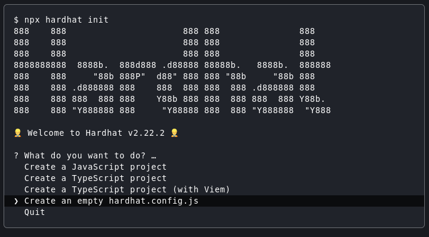
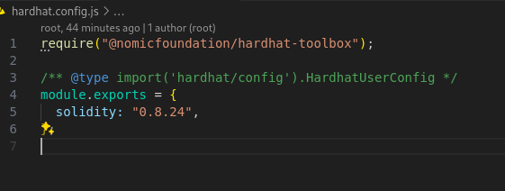
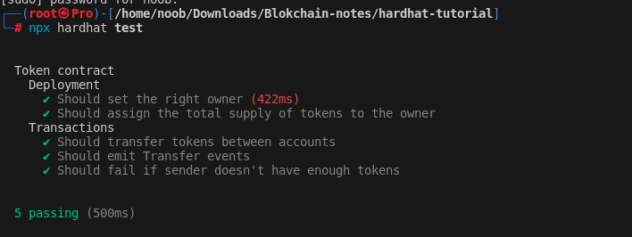

# Hardhat notes

## Contents

- [Introduction](#introduction)
- [Installation](#installation)
    - [Pre-requisites](#pre-requisites)
    - [Creating a new project](#creating-a-new-project)
    - [Installing Hardhat](#installing-hardhat)

- [writing and compiling contracts](#writing-and-compiling-contracts)
    - [Writing contracts](#writing-contracts)
    - [Compiling contracts](#compiling-contracts)

- [Testing contracts](#testing-contracts)
    - [Writing tests](#writing-tests)
    - [Running tests](#running-tests)
- [Deploying contracts to live network](#deploying-contracts)

## Introduction

Hardhat is a development environment to compile, deploy, test, and debug your Ethereum software. It helps developers manage and automate the recurring tasks that are inherent to the process of building smart contracts and dApps, as well as easily introducing more functionality around this workflow.

## Installation

### Pre-requisites

- `Node.js`
    ```bash
    # remove old versions
    $ sudo apt remove nodejs
    # install nodejs
    $ sudo apt install nodejs
    ```
- `npm`
    ```bash
    # remove old versions
    $ sudo apt remove npm
    # install npm
    $ sudo apt install npm
    ```

### Creating a new project
    
- Create a new directory for your project
    ```bash
    $ mkdir my-project
    $ cd my-project
    ```
- Initialize a new npm project
    ```bash
    $ npm init -y
    ```
- Install Hardhat
    ```bash
    $ npm install --save-dev hardhat
    ```
- Initialize Hardhat
    ```bash
    $ npx hardhat
    ```
- Choose `Create an empty hardhat.config.js` and press enter
    

- Install the Hardhat plugin for ethers.js, we will use recommended plugins here
    ```bash
    $ npm install --save-dev @nomicfoundation/hardhat-toolbox
    ```
- Add the following lines to `hardhat.config.js`
    ```javascript
    require("@nomicfoundation/hardhat-toolbox");
    ```
    - wchich will look like this
    

## Writing and compiling contracts


### Writing contracts

- Create a new contract file in the `contracts/` directory
    ```bash
    $ touch contracts/Token.sol
    ```
- Write your contract in the file you just created.
    - [Sample contract](contracts/Token.sol)

### Compiling contracts

- Run the following command to compile your contracts
    ```bash
    $ npx hardhat compile
    Compiled 1 Solidity file successfully (evm target: paris).
    ```
    
## Testing contracts

### Writing tests

- Create a new test file in the `test/` directory
    ```bash
    $ touch test/Token.js
    ```
- Write your tests in the file you just created.
    - [Sample test](test/Token.js)

### Running tests

- Run the following command to run your tests
    ```bash
    $ npx hardhat test
    ```
    - which will look like this
    
    
## Deploying contracts to live network
