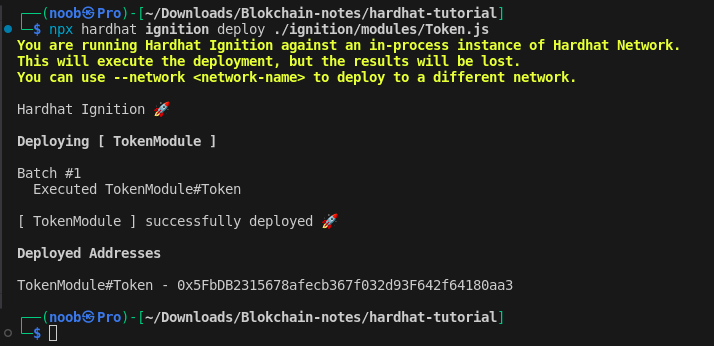

# Hardhat notes

## Contents

- [Introduction](#introduction)
- [Installation](#installation)
    - [Pre-requisites](#pre-requisites)
    - [Creating a new project](#creating-a-new-project)
    - [Installing Hardhat](#installing-hardhat)
- [writing and compiling contracts](#writing-and-compiling-contracts)
    - [Writing contracts](#writing-contracts)
    - [Compiling contracts](#compiling-contracts)
- [Testing contracts](#testing-contracts)
    - [Writing tests](#writing-tests)
    - [Running tests](#running-tests)
- [Deploying contracts to live network](#deploying-contracts)
    - [Deployment to remote networks](#deployment-to-remote-networks)
- [Conclusion](#conclusion)
- [References](#references)

## Introduction

Hardhat is a development environment to compile, deploy, test, and debug your Ethereum software. It helps developers manage and automate the recurring tasks that are inherent to the process of building smart contracts and dApps, as well as easily introducing more functionality around this workflow.

## Installation

### Pre-requisites

- `Node.js`
    ```bash
    # remove old versions
    $ sudo apt remove nodejs
    # install nodejs
    $ sudo apt install nodejs
    ```
- `npm`
    ```bash
    # remove old versions
    $ sudo apt remove npm
    # install npm
    $ sudo apt install npm
    ```

### Creating a new project
    
- Create a new directory for your project
    ```bash
    $ mkdir my-project
    $ cd my-project
    ```
- Initialize a new npm project
    ```bash
    $ npm init -y
    ```
- Install Hardhat
    ```bash
    $ npm install --save-dev hardhat
    ```
- Initialize Hardhat
    ```bash
    $ npx hardhat
    ```
- Choose `Create an empty hardhat.config.js` and press enter

    

- Install the Hardhat plugin for ethers.js, we will use recommended plugins here
    ```bash
    $ npm install --save-dev @nomicfoundation/hardhat-toolbox
    ```
- Add the following lines to `hardhat.config.js`
    ```javascript
    require("@nomicfoundation/hardhat-toolbox");
    ```
    - wchich will look like this

        

## Writing and compiling contracts


### Writing contracts

- Create a new contract file in the `contracts/` directory
    ```bash
    $ touch contracts/Token.sol
    ```
- Write your contract in the file you just created.
    - [Sample contract](contracts/Token.sol)

### Compiling contracts

- Run the following command to compile your contracts
    ```bash
    $ npx hardhat compile
    Compiled 1 Solidity file successfully (evm target: paris).
    ```
    
## Testing contracts

### Writing tests

- Create a new test file in the `test/` directory
    ```bash
    $ touch test/Token.js
    ```
- Write your tests in the file you just created.
    - [Sample test](test/Token.js)

### Running tests

- Run the following command to run your tests
    ```bash
    $ npx hardhat test
    ```
    - which will look like this

        
    
## Deploying contracts to live network

In Hardhat Ignition, deployments are defined through Ignition Modules. These modules are abstractions to describe a deployment; that is, JavaScript functions that specify what you want to deploy.

Ignition modules are expected to be within the `./ignition/modules` directory. Let's create a new directory `ignition` inside the project root's directory, then, create a directory named `modules` inside of the `ignition` directory. Paste the following into a `Token.js` file in that directory:
    
Check Here: [Sample deployment module](ignition/modules/Token.js)

To tell Hardhat to connect to a specific Ethereum network, you can use the --network parameter when running any task, like this:
    
```bash
$ npx hardhat ignition deploy ./ignition/modules/Token.js --network <network-name>
```
- If we dont use `--network` parameter, deployment actually gets lost when Hardhat finishes running, but still can be used for testing purposes.

    

### Deployment to remote networks

- To deploy to a remote network, you need to specify the network in the `hardhat.config.js` file. Here is an example of how to deploy to the Rinkeby testnet:

    ```javascript
    require("@nomicfoundation/hardhat-toolbox");

    // Ensure your configuration variables are set before executing the script
    const { vars } = require("hardhat/config");

    // Go to https://infura.io, sign up, create a new API key
    // in its dashboard, and add it to the configuration variables
    const INFURA_API_KEY = vars.get("INFURA_API_KEY");

    // Add your Sepolia account private key to the configuration variables
    // To export your private key from Coinbase Wallet, go to
    // Settings > Developer Settings > Show private key
    // To export your private key from Metamask, open Metamask and
    // go to Account Details > Export Private Key
    // Beware: NEVER put real Ether into testing accounts
    const SEPOLIA_PRIVATE_KEY = vars.get("SEPOLIA_PRIVATE_KEY");

    module.exports = {
    solidity: "0.8.24",
    networks: {
        sepolia: {
        url: `https://sepolia.infura.io/v3/${INFURA_API_KEY}`,
        accounts: [SEPOLIA_PRIVATE_KEY],
        },
    },
    };
    ```