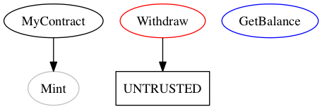
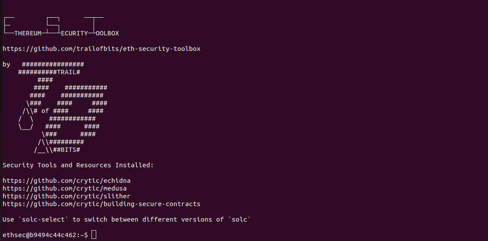

# solidity-sec-audit

## Prerequisites
  - Install [Docker](/Docker.md)
  - Pull [devopstestlab/solgraph](https://www.npmjs.com/package/solgraph) : `docker pull devopstestlab/solgraph`.
    
## Create the smart contract in solidity:
```
sudo mkdir data
cd data
sudo vi MyContracts.sol
```
Run this smart contract in the docker image we just pulled:
```docker run -it --rm -v $PWD:/data devopstestlab/solgraph```

View the image using: `xdg-open MyContracts.sol.png`




## Solidity smart contracts security audit images:
```
Mythril
Slither (https://github.com/crytic/slither)
Securify

```

## Using slither:
```
docker pull trailofbits/eth-security-toolbox
```
Create a new mycontract.sol (Voting Blockchain):
```solidity
contract MyContract {
  uint balance;

  function MyContract() {
    Mint(1000000);
  }

  function Mint(uint amount) internal {
    balance = amount;
  }

  function Withdraw() {
    msg.sender.send(balance);
  }

  function GetBalance() constant returns(uint) {
    return balance;
  }
}
```

Mount the contracts data directory to the container and run it:
```
$ docker run -v $(pwd)/contracts:/contracts/ trailofbits/eth-security-toolbox bash -c "solc /contracts/mycontract.sol"
```



Note that one could've directly opened an interactive terminal using `docker run -it -v $(pwd)/contracts:/contracts/ trailofbits/eth-security-toolbox bash`
